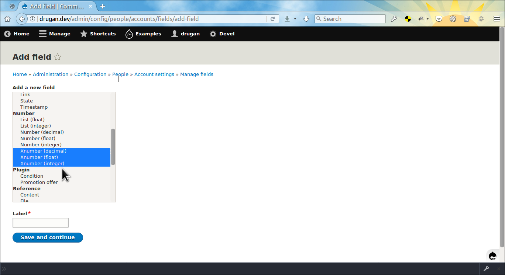
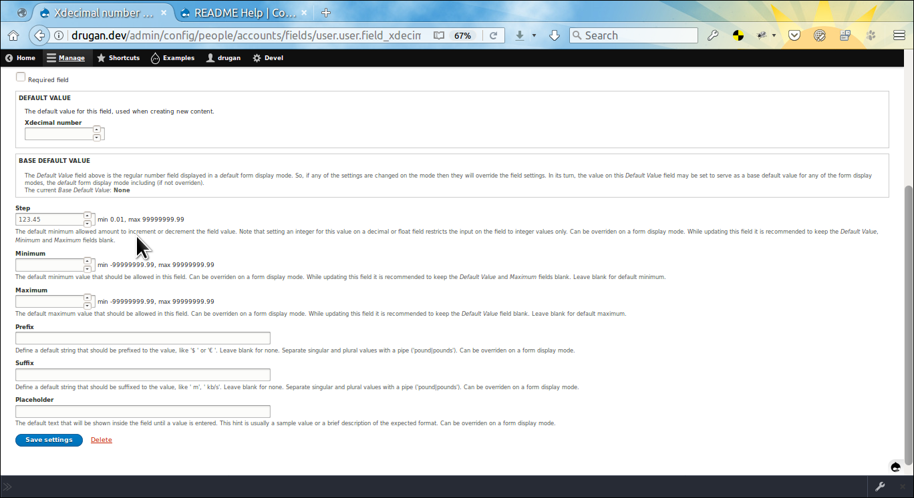
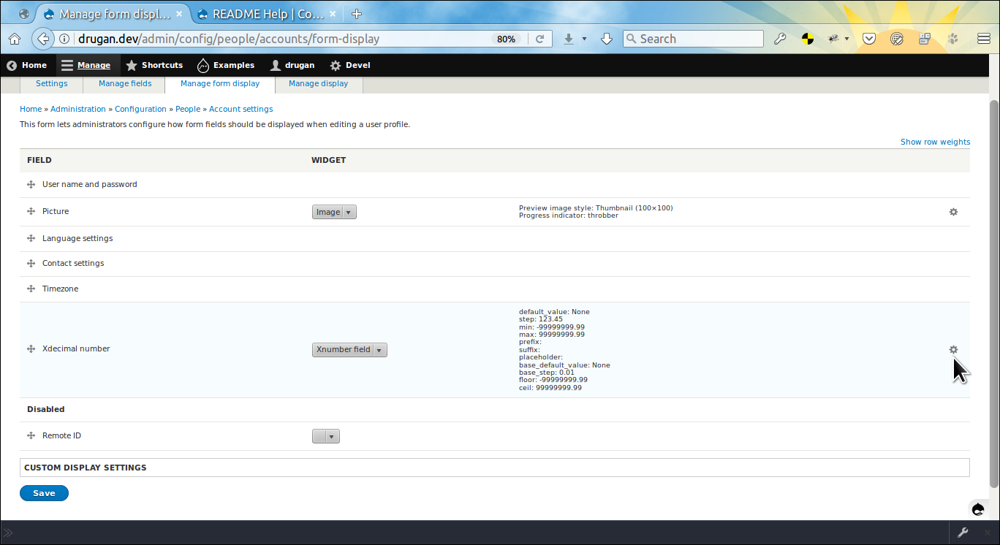
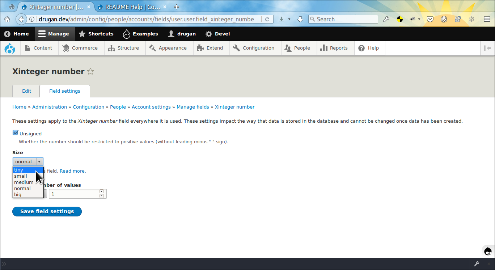

Extended Number Field
=====================

Adds extended **xinteger**, **xdecimal**, **xfloat** field types
and **xnumber** form display widget. Additionally, each type is provided with
the *unsigned* storage setting, allowing to restrict input on a field only to
positive values. One more useful feature of the module is
working *Default value* property, which has no any effect on the current core
set up, despite being exposed as one of the field settings.

> Tip: you can see this file in your browser by clicking
the [admin/help#](#0 "? Help") link at the right of the *Admin toolbar* and then
the [admin/help/xnumber#](#0 "Extended Number Field") link in the list, if you
have the [drupal/readmehelp](https://www.drupal.org/project/readmehelp) module installed.

The module was created as a solution for the following *Drupal* core issues:

- [Issue \#2816859: Allow the 'step' to be configured as a NumberWidget setting ↗](https://www.drupal.org/node/2816859)
- [Issue \#1840594: Default values not saved  ↗](https://www.drupal.org/node/1840594)
- [Issue \#2838121: Numeric item min/max settings ignored if set to 0  ↗](https://www.drupal.org/node/2838121)

________________________________________________________________________________



________________________________________________________________________________

- [admin/help/xnumber#field-settings](#field-settings "Field settings")
- [admin/help/xnumber#field-widget](#field-widget "Field widget")
- [admin/help/xnumber#storage-settings](#storage-settings "Storage settings")
- [admin/help/xnumber#important-notes](#important-notes "Important notes")
- [admin/help/xnumber#module-author](#module-author "Module author")
- [Extended Number Field on drupal.org ↗](https://www.drupal.org/project/xnumber)
- [Extended Number Field on github.com ↗](https://github.com/drugan/xnumber)

________________________________________________________________________________

## Field settings

The difference with the core *decimal*, *float* and *integer* number field types
is that you can set *step* and *placeholder* properties on a field settings page.
Notice edge *min* and *max* values (floor and ceil) at the right of numeric
properties which are set automatically for the
given *unsigned*, *precision* and *scale* storage settings of the decimal field.



## Field widget

Field settings defined on the page above will also be effective for any of the
form display modes and can be overriden on a mode's *Xnumber field* form display
widget. Note that widget can be also assigned for the
core *decimal*, *float* and *integer* number field types.



## Storage settings

The *xinteger* number type additionally can be restricted for size on the field
storage settings page. So, if you want your number to be in the range 0-255 then
check *Unsigned* checkbox and choose *tiny* size option for the field. Note
that for now the *big* option has the same size as the *normal* option, until
the error emitted on an attempt to save the maximum value of the size will be
fixed (*big*: 0-18446744073709551615). Read
more [here ↗](https://dev.mysql.com/doc/refman/5.7/en/integer-types.html)



## Important notes

When saving settings either on the base field settings page or on
the *Xnumber field* widget it is recommended to do it with the multi-step
workflow. First, set and save the *Step* property on a field which is the
definitive setting for all the rest numeric properties. Then, using the controls
at the right of the *Minimum* property field set the desirable value (optional).
Save it. After that, you may set the *Maximum* property (optional). And finally,
set the *Default value* which will be pre-filled for a user on a form display
page (optional).

The same with changing the earlier saved *Step* property. First, set blank the
*Default value*, *Minimum* and *Maximum* properties and then repeat the above
process. Later, when you grasp how the module works you can set all the settings
in one go without getting error messages on an attempt to save a wrong value.

## TODO

- [Issue #52153: Add Number::format with settings to configure decimal point and thousands separators ↗](https://www.drupal.org/project/drupal/issues/52153)

###### Module author:

```
  Vlad Proshin (drugan)
  [proshins@gmail.com](proshins@gmail.com)
  [https://drupal.org/u/drugan](https://drupal.org/u/drugan)
```
